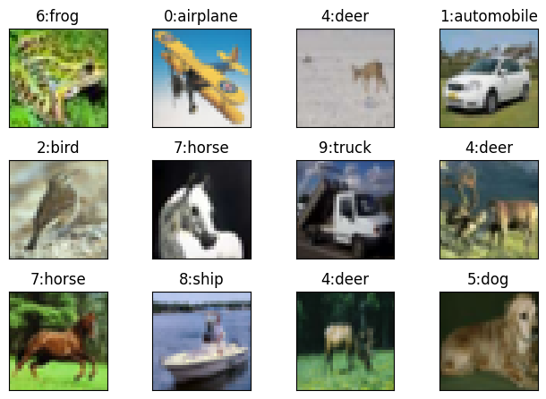
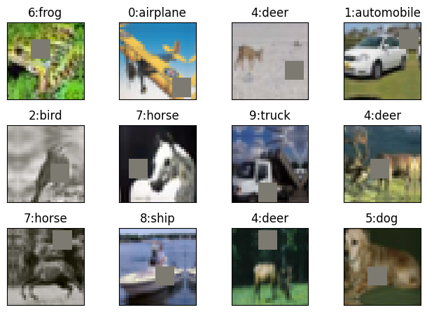
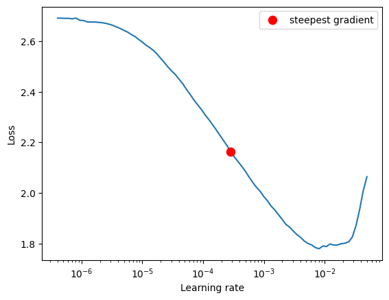
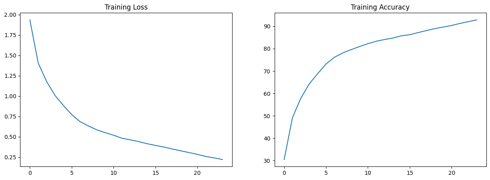
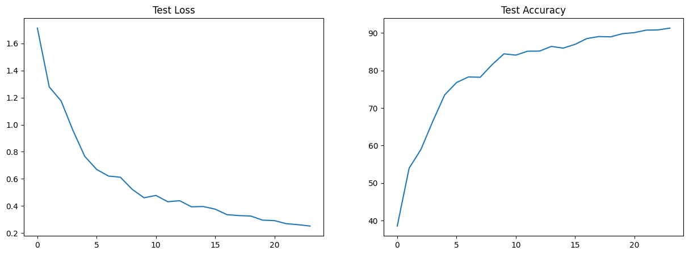
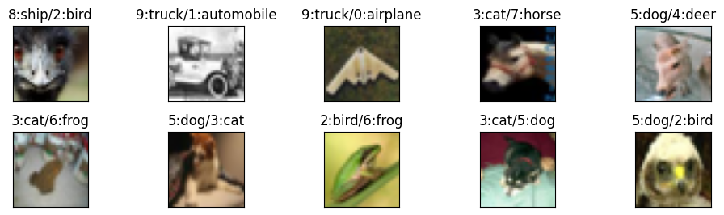

# ERA V1 Session 10

## Code Structure

### 1a. datasets/generic.py Module
The datasets module contains a generic MyDataSet class which creates train and test loaders and can visualise examples with labels.
It also performs basic transforms like Normalize and ToTensorV2.

We have two datasets currently in the modeule MNIST and CIFAR10 but can easily be extended with more datasets.



### 1b. datasets/cifar10.py Module
This module inherits the generic module and applies operations specific to cifar10 which include the Image Augmentations.
Image Augmentations used:
```python
import albumentations as A

alb_transforms = [
    A.Normalize(mean, std),
    A.ToGray(p=0.2),
    A.PadIfNeeded(40, 40, p=1),
    A.RandomCrop(32, 32, p=1),
    A.HorizontalFlip(p=0.5),
    # Since normalisation was the first step, mean is already 0, so cutout fill_value = 0
    A.CoarseDropout(max_holes=1, max_height=8, max_width=8, fill_value=0, p=1),
    A.pytorch.ToTensorV2()
]
```



### 2. model.py Module
Since the model is very large and was observed to overfit, we added dropout.

```
=============================================================================================================================
Layer (type:depth-idx)                             Output Shape              Param #                   Param %
=============================================================================================================================
Model                                              [512, 10]                 --                             --
├─Sequential: 1-1                                  [512, 10]                 --                             --
│    └─CustomLayer: 2-1                            [512, 64, 32, 32]         --                             --
│    │    └─ConvLayer: 3-1                         [512, 64, 32, 32]         --                             --
│    │    │    └─Sequential: 4-1                   [512, 64, 32, 32]         --                             --
│    │    │    │    └─Conv2d: 5-1                  [512, 64, 32, 32]         1,728                       0.03%
│    │    │    │    └─BatchNorm2d: 5-2             [512, 64, 32, 32]         128                         0.00%
│    │    │    │    └─ReLU: 5-3                    [512, 64, 32, 32]         --                             --
│    │    │    │    └─Dropout: 5-4                 [512, 64, 32, 32]         --                             --
│    └─CustomLayer: 2-2                            [512, 128, 16, 16]        --                             --
│    │    └─ConvLayer: 3-2                         [512, 128, 16, 16]        --                             --
│    │    │    └─Sequential: 4-2                   [512, 128, 16, 16]        --                             --
│    │    │    │    └─Conv2d: 5-5                  [512, 128, 32, 32]        73,728                      1.12%
│    │    │    │    └─MaxPool2d: 5-6               [512, 128, 16, 16]        --                             --
│    │    │    │    └─BatchNorm2d: 5-7             [512, 128, 16, 16]        256                         0.00%
│    │    │    │    └─ReLU: 5-8                    [512, 128, 16, 16]        --                             --
│    │    │    │    └─Dropout: 5-9                 [512, 128, 16, 16]        --                             --
│    │    └─Sequential: 3-3                        [512, 128, 16, 16]        --                             --
│    │    │    └─ConvLayer: 4-3                    [512, 128, 16, 16]        --                             --
│    │    │    │    └─Sequential: 5-10             [512, 128, 16, 16]        --                             --
│    │    │    │    │    └─Conv2d: 6-1             [512, 128, 16, 16]        147,456                     2.24%
│    │    │    │    │    └─BatchNorm2d: 6-2        [512, 128, 16, 16]        256                         0.00%
│    │    │    │    │    └─ReLU: 6-3               [512, 128, 16, 16]        --                             --
│    │    │    │    │    └─Dropout: 6-4            [512, 128, 16, 16]        --                             --
│    │    │    └─ConvLayer: 4-4                    [512, 128, 16, 16]        --                             --
│    │    │    │    └─Sequential: 5-11             [512, 128, 16, 16]        --                             --
│    │    │    │    │    └─Conv2d: 6-5             [512, 128, 16, 16]        147,456                     2.24%
│    │    │    │    │    └─BatchNorm2d: 6-6        [512, 128, 16, 16]        256                         0.00%
│    │    │    │    │    └─ReLU: 6-7               [512, 128, 16, 16]        --                             --
│    │    │    │    │    └─Dropout: 6-8            [512, 128, 16, 16]        --                             --
│    └─CustomLayer: 2-3                            [512, 256, 8, 8]          --                             --
│    │    └─ConvLayer: 3-4                         [512, 256, 8, 8]          --                             --
│    │    │    └─Sequential: 4-5                   [512, 256, 8, 8]          --                             --
│    │    │    │    └─Conv2d: 5-12                 [512, 256, 16, 16]        294,912                     4.49%
│    │    │    │    └─MaxPool2d: 5-13              [512, 256, 8, 8]          --                             --
│    │    │    │    └─BatchNorm2d: 5-14            [512, 256, 8, 8]          512                         0.01%
│    │    │    │    └─ReLU: 5-15                   [512, 256, 8, 8]          --                             --
│    │    │    │    └─Dropout: 5-16                [512, 256, 8, 8]          --                             --
│    └─CustomLayer: 2-4                            [512, 512, 4, 4]          --                             --
│    │    └─ConvLayer: 3-5                         [512, 512, 4, 4]          --                             --
│    │    │    └─Sequential: 4-6                   [512, 512, 4, 4]          --                             --
│    │    │    │    └─Conv2d: 5-17                 [512, 512, 8, 8]          1,179,648                  17.95%
│    │    │    │    └─MaxPool2d: 5-18              [512, 512, 4, 4]          --                             --
│    │    │    │    └─BatchNorm2d: 5-19            [512, 512, 4, 4]          1,024                       0.02%
│    │    │    │    └─ReLU: 5-20                   [512, 512, 4, 4]          --                             --
│    │    │    │    └─Dropout: 5-21                [512, 512, 4, 4]          --                             --
│    │    └─Sequential: 3-6                        [512, 512, 4, 4]          --                             --
│    │    │    └─ConvLayer: 4-7                    [512, 512, 4, 4]          --                             --
│    │    │    │    └─Sequential: 5-22             [512, 512, 4, 4]          --                             --
│    │    │    │    │    └─Conv2d: 6-9             [512, 512, 4, 4]          2,359,296                  35.89%
│    │    │    │    │    └─BatchNorm2d: 6-10       [512, 512, 4, 4]          1,024                       0.02%
│    │    │    │    │    └─ReLU: 6-11              [512, 512, 4, 4]          --                             --
│    │    │    │    │    └─Dropout: 6-12           [512, 512, 4, 4]          --                             --
│    │    │    └─ConvLayer: 4-8                    [512, 512, 4, 4]          --                             --
│    │    │    │    └─Sequential: 5-23             [512, 512, 4, 4]          --                             --
│    │    │    │    │    └─Conv2d: 6-13            [512, 512, 4, 4]          2,359,296                  35.89%
│    │    │    │    │    └─BatchNorm2d: 6-14       [512, 512, 4, 4]          1,024                       0.02%
│    │    │    │    │    └─ReLU: 6-15              [512, 512, 4, 4]          --                             --
│    │    │    │    │    └─Dropout: 6-16           [512, 512, 4, 4]          --                             --
│    └─MaxPool2d: 2-5                              [512, 512, 1, 1]          --                             --
│    └─Flatten: 2-6                                [512, 512]                --                             --
│    └─Linear: 2-7                                 [512, 10]                 5,130                       0.08%
=============================================================================================================================
Total params: 6,573,130
Trainable params: 6,573,130
Non-trainable params: 0
Total mult-adds (Units.GIGABYTES): 194.18
=============================================================================================================================
Input size (MB): 6.29
Forward/backward pass size (MB): 2382.41
Params size (MB): 26.29
Estimated Total Size (MB): 2414.99
=============================================================================================================================
```

### 3. backprop.py Module
This module contains 3 classes:
1. Experiment
2. Train
3. Test

Experiment class performs train-test iterations for a given number of epochs or a given validation target. It can also find and plot misclassified examples using a simple function.

It also finds the max LR using LRFinder for OneCycleLR.



Train and Test classes perform training and testing respectively on given model and dataset. They also accumulate statistics which can be plotted using a simple member functions.

### 4. utils.py Modele
This module contains miscellaneous functions like detecting device and setting random seed.

## The Results

Best Train Accuracy: 92.86%

Best Test Accuracy: 91.3%




Misclassified Images:


